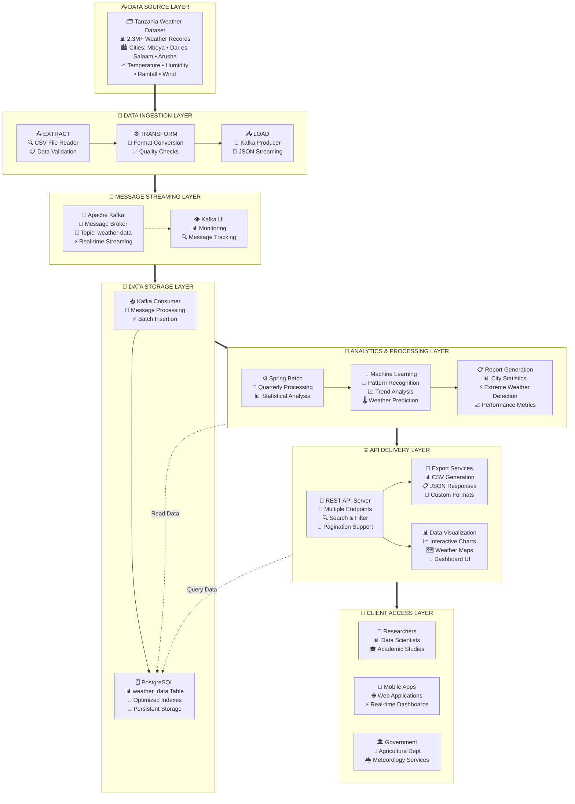

# 🌦️ Tanzania Weather Data Batch Processing System

```mermaid
graph TB
    %% Input Layer
    subgraph INPUT["📥 DATA SOURCE LAYER"]
        SRC[🗂️ Tanzania Weather Dataset<br/>📊 2.3M+ Weather Records<br/>🏙️ Cities: Mbeya • Dar es Salaam • Arusha<br/>📈 Temperature • Humidity • Rainfall • Wind]
    end
    
    %% Ingestion Layer  
    subgraph INGEST["🔄 DATA INGESTION LAYER"]
        direction LR
        ETL1[📤 EXTRACT<br/>🔍 CSV File Reader<br/>📋 Data Validation]
        ETL2[⚙️ TRANSFORM<br/>🔧 Format Conversion<br/>✅ Quality Checks] 
        ETL3[📥 LOAD<br/>🚀 Kafka Producer<br/>📡 JSON Streaming]
        
        ETL1 --> ETL2 --> ETL3
    end
    
    %% Middleware Layer
    subgraph MIDDLEWARE["🔗 MESSAGE STREAMING LAYER"]
        direction LR
        KAFKA[🌊 Apache Kafka<br/>📨 Message Broker<br/>🎯 Topic: weather-data<br/>⚡ Real-time Streaming]
        MONITOR[👁️ Kafka UI<br/>📊 Monitoring<br/>🔍 Message Tracking]
        
        KAFKA -.-> MONITOR
    end
    
    %% Storage Layer
    subgraph STORAGE["💾 DATA STORAGE LAYER"]
        direction LR
        CONSUMER[📥 Kafka Consumer<br/>🔄 Message Processing<br/>⚡ Batch Insertion]
        DATABASE[🗄️ PostgreSQL<br/>📊 weather_data Table<br/>🚀 Optimized Indexes<br/>💽 Persistent Storage]
        
        CONSUMER --> DATABASE
    end
    
    %% Processing Layer
    subgraph PROCESSING["🧠 ANALYTICS & PROCESSING LAYER"]
        direction LR
        BATCH[⚙️ Spring Batch<br/>🔄 Quarterly Processing<br/>📊 Statistical Analysis]
        ML[🤖 Machine Learning<br/>🎯 Pattern Recognition<br/>📈 Trend Analysis<br/>🌡️ Weather Prediction]
        REPORTS[📋 Report Generation<br/>📊 City Statistics<br/>⚡ Extreme Weather Detection<br/>📈 Performance Metrics]
        
        BATCH --> ML --> REPORTS
    end
    
    %% API Layer
    subgraph API["🌐 API DELIVERY LAYER"]
        direction LR
        REST[🔗 REST API Server<br/>📱 Multiple Endpoints<br/>🔍 Search & Filter<br/>📄 Pagination Support]
        EXPORT[📁 Export Services<br/>📊 CSV Generation<br/>📋 JSON Responses<br/>🎯 Custom Formats]
        VISUAL[📊 Data Visualization<br/>📈 Interactive Charts<br/>🗺️ Weather Maps<br/>📱 Dashboard UI]
        
        REST --> EXPORT
        REST --> VISUAL
    end
    
    %% Output Layer
    subgraph OUTPUT["👥 CLIENT ACCESS LAYER"]
        direction LR
        RESEARCH[🔬 Researchers<br/>📊 Data Scientists<br/>🎓 Academic Studies]
        APPS[📱 Mobile Apps<br/>🌐 Web Applications<br/>⚡ Real-time Dashboards]
        GOV[🏛️ Government<br/>🌾 Agriculture Dept<br/>🌦️ Meteorology Services]
    end
    
    %% Data Flow Connections
    SRC ==> INGEST
    INGEST ==> MIDDLEWARE  
    MIDDLEWARE ==> STORAGE
    STORAGE ==> PROCESSING
    PROCESSING ==> API
    API ==> OUTPUT
    
    %% Side Connections
    PROCESSING -.->|Read Data| DATABASE
    API -.->|Query Data| DATABASE
```
