```mermaid
graph TB
    %% Input Layer
    subgraph INPUT["📥 DATA SOURCE LAYER"]
        SRC[ğŸ—‚ï¸ Tanzania Weather Dataset<br/>📊 2.3M+ Weather Records<br/>ğŸ™ï¸ Cities: Mbeya • Dar es Salaam • Arusha<br/>📈 Temperature • Humidity • Rainfall • Wind]
    end
    
    %% Ingestion Layer  
    subgraph INGEST["🔄 DATA INGESTION LAYER"]
        direction LR
        ETL1[📤 EXTRACT<br/>🔠CSV File Reader<br/>📋 Data Validation]
        ETL2[âš™ï¸ TRANSFORM<br/>🔧 Format Conversion<br/>✅ Quality Checks] 
        ETL3[📥 LOAD<br/>🚀 Kafka Producer<br/>📡 JSON Streaming]
        
        ETL1 --> ETL2 --> ETL3
    end
    
    %% Middleware Layer
    subgraph MIDDLEWARE["🔗 MESSAGE STREAMING LAYER"]
        direction LR
        KAFKA[🌊 Apache Kafka<br/>📨 Message Broker<br/>🯠Topic: weather-data<br/>⚡ Real-time Streaming]
        MONITOR[ğŸ‘ï¸ Kafka UI<br/>📊 Monitoring<br/>🔠Message Tracking]
        
        KAFKA -.-> MONITOR
    end
    
    %% Storage Layer
    subgraph STORAGE["💾 DATA STORAGE LAYER"]
        direction LR
        CONSUMER[📥 Kafka Consumer<br/>🔄 Message Processing<br/>⚡ Batch Insertion]
        DATABASE[ğŸ—„ï¸ PostgreSQL<br/>📊 weather_data Table<br/>🚀 Optimized Indexes<br/>💽 Persistent Storage]
        
        CONSUMER --> DATABASE
    end
    
    %% Processing Layer
    subgraph PROCESSING["🧠 ANALYTICS & PROCESSING LAYER"]
        direction LR
        BATCH[âš™ï¸ Spring Batch<br/>🔄 Quarterly Processing<br/>📊 Statistical Analysis]
        ML[🤖 Machine Learning<br/>🯠Pattern Recognition<br/>📈 Trend Analysis<br/>ğŸŒ¡ï¸ Weather Prediction]
        REPORTS[📋 Report Generation<br/>📊 City Statistics<br/>⚡ Extreme Weather Detection<br/>📈 Performance Metrics]
        
        BATCH --> ML --> REPORTS
    end
    
    %% API Layer
    subgraph API["🌠API DELIVERY LAYER"]
        direction LR
        REST[🔗 REST API Server<br/>📱 Multiple Endpoints<br/>🔠Search & Filter<br/>📄 Pagination Support]
        EXPORT[📠Export Services<br/>📊 CSV Generation<br/>📋 JSON Responses<br/>🯠Custom Formats]
        VISUAL[📊 Data Visualization<br/>📈 Interactive Charts<br/>ğŸ—ºï¸ Weather Maps<br/>📱 Dashboard UI]
        
        REST --> EXPORT
        REST --> VISUAL
    end
    
    %% Output Layer
    subgraph OUTPUT["👥 CLIENT ACCESS LAYER"]
        direction LR
        RESEARCH[🔬 Researchers<br/>📊 Data Scientists<br/>📠Academic Studies]
        APPS[📱 Mobile Apps<br/>🌠Web Applications<br/>⚡ Real-time Dashboards]
        GOV[ğŸ›ï¸ Government<br/>🌾 Agriculture Dept<br/>ğŸŒ¦ï¸ Meteorology Services]
    end
    
    %% Data Flow Connections
    SRC ==> INGEST
    INGEST ==> MIDDLEWARE  
    MIDDLEWARE ==> STORAGE
    STORAGE ==> PROCESSING
    PROCESSING ==> API
    API ==> OUTPUT
    
    %% Side Connections
    PROCESSING -.->|Read Data| DATABASE
    API -.->|Query Data| DATABASE
```

# 🌦️ Tanzania Weather Data Batch Processing System


## Project Overview

This project is a microservices-based system designed to process, analyze, and deliver weather data from Tanzania. The system handles over 2.3 million weather records from various Tanzanian cities including Mbeya, Dar es Salaam, Arusha, and other major urban centers.

## System Purpose

The system serves multiple purposes:
- Process large volumes of weather data efficiently
- Provide real-time data streaming and storage
- Generate analytical insights and reports
- Offer easy data access through REST APIs
- Support research, planning, and decision-making activities

## System Architecture

The system follows a microservices architecture pattern with four independent services communicating through Apache Kafka message streaming and sharing a PostgreSQL database.

```mermaid
graph TD
    %% External Components
    CSV[CSV Files<br/>Weather Data] --> DIS
    
    %% Infrastructure Components
    KAFKA[(Kafka Broker<br/>weather-data topic)]
    DB[(PostgreSQL<br/>weather_data table)]
    
    %% Microservices
    DIS[Data Ingestion Service<br/>Port 8081]
    DSS[Data Storage Service<br/>Port 8082]
    DPS[Data Processing Service<br/>Port 8083]
    DDS[Data Delivery Service<br/>Port 8084]
    
    %% Data Flow Connections
    DIS -->|Streams JSON| KAFKA
    KAFKA -->|Consumes Messages| DSS
    DSS -->|Stores Records| DB
    DPS -->|Reads Data| DB
    DB -->|Query Results| DDS
    
    %% Service Interactions
    DPS -->|Analytics Results| DB
    
    %% Visualization & Dashboard Layer
    subgraph DASHBOARD["🎨 VISUALIZATION & DASHBOARD LAYER"]
        WEB[🌐 Web Dashboard<br/>React/Angular Frontend<br/>Real-time Charts & Maps]
        MOBILE[📱 Mobile App<br/>Weather Insights<br/>Push Notifications]
        ADMIN[⚙️ Admin Panel<br/>System Monitoring<br/>Data Management]
        REPORTS[📊 Report Portal<br/>PDF Generation<br/>Scheduled Reports]
    end
    

    

    
    %% Dashboard Connections
    DDS -->|REST API| DASHBOARD
    

    
    %% Styling for different component types
    classDef service fill:#e1f5fe,stroke:#01579b,stroke-width:2px
    classDef infrastructure fill:#f3e5f5,stroke:#4a148c,stroke-width:2px
    classDef external fill:#e8f5e8,stroke:#1b5e20,stroke-width:2px
    classDef dashboard fill:#fff3e0,stroke:#f57c00,stroke-width:2px
    
    class DIS,DSS,DPS,DDS service
    class KAFKA,DB infrastructure
    class CSV external
    class WEB,MOBILE,ADMIN,REPORTS dashboard
```



## Service Components

### 1. Data Ingestion Service (Port 8081)

**Purpose**: Reads weather data from CSV files and streams it to Kafka topics.

**Key Functions**:
- Parse CSV files containing weather measurements
- Validate data format and structure
- Send individual weather records to Kafka topics
- Handle European decimal format conversion
- Process large files asynchronously

**Technology Stack**:
- Spring Boot
- Spring Kafka Producer
- CSV parsing utilities


### 2. Data Storage Service (Port 8082)

**Purpose**: Consumes weather data from Kafka and persists it to PostgreSQL database.

**Key Functions**:
- Listen to Kafka weather-data topic
- Parse JSON messages from Kafka
- Validate and store weather records in database
- Handle duplicate detection and error recovery
- Maintain data integrity and indexing

**Technology Stack**:
- Spring Boot
- Spring Kafka Consumer
- Spring Data JPA
- PostgreSQL


### 3. Data Processing Service (Port 8083)

**Purpose**: Performs analytics and generates insights from stored weather data.

**Key Functions**:
- Generate quarterly weather reports
- Calculate city-specific statistics
- Identify extreme weather events
- Compute temperature, humidity, and rainfall trends
- Create analytical summaries

**Technology Stack**:
- Spring Boot
- Spring Data JPA
- Statistical processing algorithms


### 4. Data Delivery Service (Port 8084)

**Purpose**: Provides REST API access to weather data and analytics.

**Key Functions**:
- Serve weather data through REST endpoints
- Support filtering by city, date range, and temperature
- Provide paginated responses for large datasets
- Export data in CSV format
- Generate real-time statistics

**Technology Stack**:
- Spring Boot
- Spring Web
- Spring Data JPA
- REST API development

## Data Flow Process


## Infrastructure Components

### Apache Kafka
- **Topic**: weather-data
- **Purpose**: Real-time message streaming between services
- **Configuration**: Single partition for development
- **Message Format**: JSON with weather measurements

### PostgreSQL Database
- **Database Name**: weather_data
- **Table**: weather_data
- **Indexes**: Optimized for city and timestamp queries
- **Connection Pool**: Configured for concurrent access

### Docker Services
- **Zookeeper**: Kafka coordination service (Port 2181)
- **Kafka Broker**: Message streaming platform (Port 9092)
- **PostgreSQL**: Database server (Port 5432)
- **Kafka UI**: Web interface for monitoring (Port 8080)

## API Endpoints

### Data Delivery Service (Port 8084)

| Endpoint | Method | Description |
|----------|--------|-------------|
| `/api/weather/health` | GET | Service health status |
| `/api/weather/cities` | GET | List available cities |
| `/api/weather/city/{cityName}` | GET | Weather data by city (paginated) |
| `/api/weather/latest` | GET | Latest weather records |
| `/api/weather/stats` | GET | Statistical summaries |
| `/api/weather/search` | GET | Search with filters |
| `/api/weather/export/csv` | GET | Export data as CSV |

### Data Processing Service (Port 8083)

| Endpoint | Method | Description |
|----------|--------|-------------|
| `/api/analytics/quarterly` | POST | Generate quarterly reports |
| `/api/analytics/status` | GET | Processing status |
| `/api/analytics/report` | GET | Retrieve generated reports |
| `/api/analytics/health` | GET | Service health check |

### Data Ingestion Service (Port 8081)

| Endpoint | Method | Description |
|----------|--------|-------------|
| `/api/weather/ingest` | POST | Start data ingestion |
| `/api/weather/ingest/local` | POST | Ingest local Tanzania data |
| `/api/weather/test` | POST | Send test data |
| `/api/weather/health` | GET | Service health check |

## System Requirements

### Hardware Requirements
- **Memory**: Minimum 4GB RAM (8GB recommended)
- **Storage**: At least 10GB free space
- **CPU**: Multi-core processor recommended
- **Network**: Stable internet connection for Docker pulls

### Software Requirements
- **Java**: Version 17 or higher
- **Docker**: Latest version with Docker Compose
- **Maven**: Version 3.6 or higher
- **Git**: For source code management

## Installation and Deployment

### Prerequisites Setup

1. **Install Java 17+**
   ```bash
   # Verify Java installation
   java -version
   ```

2. **Install Docker and Docker Compose**
   ```bash
   # Verify Docker installation
   docker --version
   docker-compose --version
   ```

3. **Install Maven**
   ```bash
   # Verify Maven installation
   mvn --version
   ```

### Project Setup

1. **Clone the repository**
   ```bash
   git clone <repository-url>
   cd batch-processing-system
   ```

2. **Start infrastructure services**
   ```bash
   docker-compose up -d
   ```

3. **Verify infrastructure is running**
   ```bash
   # Check container status
   docker-compose ps
   
   # Access Kafka UI at http://localhost:8080
   # PostgreSQL available at localhost:5432
   ```

### Service Deployment

Start services in the following order:

1. **Data Storage Service** (Must be first to consume Kafka messages)
   ```bash
   cd data-storage-service
   ./mvnw spring-boot:run
   ```

2. **Data Ingestion Service**
   ```bash
   cd data-ingestion-service
   ./mvnw spring-boot:run
   ```

3. **Data Processing Service**
   ```bash
   cd data-processing-service
   ./mvnw spring-boot:run
   ```

4. **Data Delivery Service**
   ```bash
   cd data-delivery-service
   ./mvnw spring-boot:run
   ```

### Verification

Check all services are running:
```bash
curl http://localhost:8081/api/weather/health  # Data Ingestion
curl http://localhost:8082/actuator/health     # Data Storage
curl http://localhost:8083/api/analytics/health # Data Processing
curl http://localhost:8084/api/weather/health   # Data Delivery
```

## Usage Examples

### Data Ingestion
```bash
# Ingest Tanzania weather data
curl -X POST http://localhost:8081/api/weather/ingest/local

# Send test data
curl -X POST http://localhost:8081/api/weather/test
```

### Data Access
```bash
# Get all cities
curl http://localhost:8084/api/weather/cities

# Get weather data for Mbeya
curl "http://localhost:8084/api/weather/city/Mbeya?page=0&size=10"

# Search with temperature filter
curl "http://localhost:8084/api/weather/search?minTemp=25&maxTemp=35"

# Export data as CSV
curl "http://localhost:8084/api/weather/export/csv?city=Mbeya"
```

### Analytics
```bash
# Generate quarterly report
curl -X POST http://localhost:8083/api/analytics/quarterly

# Get processing status
curl http://localhost:8083/api/analytics/status

# Retrieve generated report
curl http://localhost:8083/api/analytics/report
```

## Troubleshooting Guide

### Common Issues

1. **Service won't start**
   - Check Java version (must be 17+)
   - Verify port availability
   - Check Docker services are running

2. **Database connection errors**
   - Verify PostgreSQL container is running
   - Check database credentials in application.yml
   - Ensure database schema exists

3. **Kafka connection issues**
   - Verify Kafka and Zookeeper containers
   - Check Kafka topic creation
   - Verify consumer group configurations

4. **Memory issues**
   - Increase JVM heap size: `-Xmx2g`
   - Monitor system memory usage
   - Consider reducing batch sizes

### Log Locations
- Application logs: Console output or configured log files
- Docker logs: `docker-compose logs <service-name>`
- Kafka UI: http://localhost:8080 for topic monitoring
- 


#### FINALIZATION PHASE OF THE PROJECTS


According this project author show that this project fullfill technical requirements because this application it goes to all stages on the processing of the batch data

The batch data of this project was extracted from Tanzania weather batch data source by he microservices of Ingest Data services, under this services the data are collected by the Tools which are Called ETL, this tools are used to extract tranform and load data into another microservices which are Data Storage services before transfered date into another microservices of Data analysis services for processing the batch data due to that fact this Application was fulfil the technical requirement of the system.

Building this thing was honestly more challenging than I expected. When I started, I thought 
"how hard can it be to process some weather data?" Turns out, quite hard when you're dealing 
with 2.3 million records and trying to make everything work together

The which are built is  reliable, scalable, and maintainable because it consider all requirement by adding proper error handling, 
database transactions, and health checks in the system which will anable to check for reliability and the system will be scaled independently to maintain scalability and the system had clear responsiblity which will anable to make maintanance of the system.

according this project the system will take the following measure to maintain data security, governance and protection which are 

● Basic database authentication 

● Services isolated in Docker containers 

● Network separation through Docker networks 


The other things which can be added into the system which can improve the security of the system are

● Proper authentication

● Encrypt everything (database, service communication) 

● Rate limiting on APIs 

● Actual monitoring and alerting 

● Backup and recovery procedures (because disasters happen) 

The next project to improve workflow have to use the following flow

●Data ingestion

●Data Processing

●Data Output and 

●Error Handling


The three most valuable technical skills I learn learned dur
ing the project are 

● programing language which are Java, Python

● Large scale Data Processing 

● Data Storage which include PostgreSQL

The three most valuable “soft” skills I learned during the project are

● Communication which includes clear communication, collaboration and documentation


● Problem solvig that include Analytical Thinking, creative problem solving and troubleshooting

● Teamwork within the system it mean that collaboration, knowledge sharing, and support


The strategy which I peruse the when I introduce a second data pipeline to your sys
tem which is able to process real-time streaming data are 


My plan:


1. Add Kafka Streams processors - These can do real-time analytics on the same data 
streams


3. Build a real-time analytics service - New microservice that processes data as it comes in 


4. WebSocket APIs - So frontends can get live updates

   
6. Keep both systems - Batch for historical analysis, streaming for immediate insights 
Implementation approach:


● Start small with basic real-time aggregations (current temperature, rainfall alerts) 


● Add WebSocket endpoints for live data feeds 


● Build a simple real-time dashboard 


● Gradually add more sophisticated real-time analytics 


