```mermaid
graph TB
    %% Input Layer
    subgraph INPUT["📥 DATA SOURCE LAYER"]
        SRC[ğŸ—‚ï¸ Tanzania Weather Dataset<br/>📊 2.3M+ Weather Records<br/>ğŸ™ï¸ Cities: Mbeya • Dar es Salaam • Arusha<br/>📈 Temperature • Humidity • Rainfall • Wind]
    end
    
    %% Ingestion Layer  
    subgraph INGEST["🔄 DATA INGESTION LAYER"]
        direction LR
        ETL1[📤 EXTRACT<br/>🔠CSV File Reader<br/>📋 Data Validation]
        ETL2[âš™ï¸ TRANSFORM<br/>🔧 Format Conversion<br/>✅ Quality Checks] 
        ETL3[📥 LOAD<br/>🚀 Kafka Producer<br/>📡 JSON Streaming]
        
        ETL1 --> ETL2 --> ETL3
    end
    
    %% Middleware Layer
    subgraph MIDDLEWARE["🔗 MESSAGE STREAMING LAYER"]
        direction LR
        KAFKA[🌊 Apache Kafka<br/>📨 Message Broker<br/>🯠Topic: weather-data<br/>⚡ Real-time Streaming]
        MONITOR[ğŸ‘ï¸ Kafka UI<br/>📊 Monitoring<br/>🔠Message Tracking]
        
        KAFKA -.-> MONITOR
    end
    
    %% Storage Layer
    subgraph STORAGE["💾 DATA STORAGE LAYER"]
        direction LR
        CONSUMER[📥 Kafka Consumer<br/>🔄 Message Processing<br/>⚡ Batch Insertion]
        DATABASE[ğŸ—„ï¸ PostgreSQL<br/>📊 weather_data Table<br/>🚀 Optimized Indexes<br/>💽 Persistent Storage]
        
        CONSUMER --> DATABASE
    end
    
    %% Processing Layer
    subgraph PROCESSING["🧠 ANALYTICS & PROCESSING LAYER"]
        direction LR
        BATCH[âš™ï¸ Spring Batch<br/>🔄 Quarterly Processing<br/>📊 Statistical Analysis]
        ML[🤖 Machine Learning<br/>🯠Pattern Recognition<br/>📈 Trend Analysis<br/>ğŸŒ¡ï¸ Weather Prediction]
        REPORTS[📋 Report Generation<br/>📊 City Statistics<br/>⚡ Extreme Weather Detection<br/>📈 Performance Metrics]
        
        BATCH --> ML --> REPORTS
    end
    
    %% API Layer
    subgraph API["🌠API DELIVERY LAYER"]
        direction LR
        REST[🔗 REST API Server<br/>📱 Multiple Endpoints<br/>🔠Search & Filter<br/>📄 Pagination Support]
        EXPORT[📠Export Services<br/>📊 CSV Generation<br/>📋 JSON Responses<br/>🯠Custom Formats]
        VISUAL[📊 Data Visualization<br/>📈 Interactive Charts<br/>ğŸ—ºï¸ Weather Maps<br/>📱 Dashboard UI]
        
        REST --> EXPORT
        REST --> VISUAL
    end
    
    %% Output Layer
    subgraph OUTPUT["👥 CLIENT ACCESS LAYER"]
        direction LR
        RESEARCH[🔬 Researchers<br/>📊 Data Scientists<br/>📠Academic Studies]
        APPS[📱 Mobile Apps<br/>🌠Web Applications<br/>⚡ Real-time Dashboards]
        GOV[ğŸ›ï¸ Government<br/>🌾 Agriculture Dept<br/>ğŸŒ¦ï¸ Meteorology Services]
    end
    
    %% Data Flow Connections
    SRC ==> INGEST
    INGEST ==> MIDDLEWARE  
    MIDDLEWARE ==> STORAGE
    STORAGE ==> PROCESSING
    PROCESSING ==> API
    API ==> OUTPUT
    
    %% Side Connections
    PROCESSING -.->|Read Data| DATABASE
    API -.->|Query Data| DATABASE
```

# Batch-Data-Processing-Architecture-Application-

The batch processing Architecture will consist of four components of microservirces which are ETL,Pre-Processing and processing microservices, Viasualization microservices and Machine learning area

under ETL, the words ETL stand for Extract Transfer and load so under this area the application show that the system will use this procedure for collecting data from the source and transfer them and loading the data into another microservices for the process and analysing of data, under this component 
the system will use python programming language for intergrating the systems in other words this area of the system is called ingestation of data.

The second component of this batch data processing system are Pre processing and processing, under this stages of the data processing the system was used to analyzed the data and store them into postgreSQL databases, under this system data will be coded and processed  by using Machine lerning and then producing the output labeled data and 

Third component of the data architecture application system are used to be displayed into Dashboard microservices' then

The fourth componet of the system are backended which used to intergrate all systems which lead to ensure reliability, scalability, and main
tainability of the system.

Advantage and Disadvantages of the bach data processing application
  advantages
1.  easy to used the system
2.  reduce time to make maintenances'
3.  Cost - Effective
4.  simple to handling error
5.  Automation
6.  Data integrity

  
    disadvantages isadvanta
1. latency
2. complex Error Recovery
3. Resources intensive
4. lack of flexibility
5. Difficulties in monitoring
6. Data Staleness
